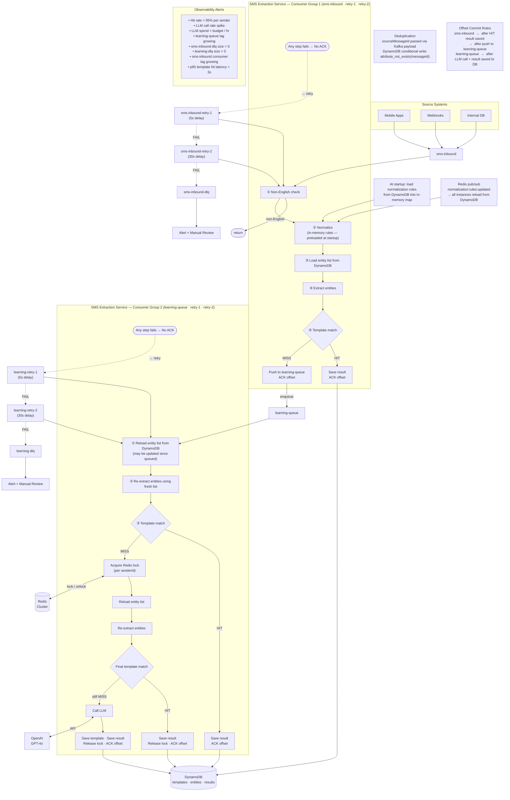

# SMS Extraction Engine — High Level Design

**Version:** 1.0
**Author:** Engineering
**Status:** In Review

---

## 1. Problem Statement

Banking and financial SMS messages arrive from hundreds of different senders across dozens of banks. Each bank formats its messages differently — different keywords, different date formats, different amount representations, different account masking. Extracting structured data (amount, merchant, account number, date, reference ID) from these messages is essential for downstream analytics, spend categorisation, and user-facing insights.

**The challenge:** There are too many format variations to hand-code rules for each one. An ML model per sender is impractical to maintain. Calling a Large Language Model (LLM) for every single message is too expensive and too slow at scale.

---

## 2. Goals

- Extract structured entities (amount, merchant, account number, date, reference ID, OTP, etc.) from raw banking SMS messages with high accuracy
- Classify each message with a category, subcategory, and intent
- LLM cost close to zero at steady state — LLM called only for new, unseen message shapes
- Sub-10ms extraction latency for known message shapes (template cache hit)
- Horizontally scalable — multiple service instances can run in parallel
- Zero code changes required to onboard a new bank or handle a new message format
- Normalization rules (abbreviation mappings, character handling) configurable at runtime

---

## 3. High-Level Architecture



---

## 4. Core Design Principle — LLM Once, Rules Forever

The system is built around a single insight: **the same bank sends structurally identical messages for the same event type.** The amount and account number change, but the surrounding text does not.

```
First message (new shape):
  "ICICI Bank Acct XX719 debited for Rs 1000.00 on 29-Apr-26; NANOSECOND TECH credited. UPI:648567170009"
  → LLM called → extraction rules learned → template saved

All future messages of the same shape:
  "ICICI Bank Acct XX248 debited for Rs 8582.00 on 27-Apr-26; ACME CORP credited. UPI:301518364819"
  → Template matched → extracted in ~1ms → LLM NOT called
```

At steady state, the vast majority of messages hit the template cache. The LLM is only called when a genuinely new message structure appears.

---

## 5. End-to-End Processing Flow

```
Kafka Message (senderId + raw SMS text)
        │
        ▼
┌───────────────────┐
│   Normalization   │  • Convert to uppercase
│                   │  • Apply keyword mappings  (RS. → INR, A/C → ACCOUNT)
│                   │  • Remove thousands separators from numbers
│                   │  • Collapse all whitespace (newlines, tabs, spaces)
│                   │  • Rules served from in-memory map (preloaded at startup)
│                   │  • Rule updates published via Redis pub/sub → all instances reload
└────────┬──────────┘
         │
         ▼
┌───────────────────┐
│  Entity Extraction│  • Load saved extraction rules for this sender from DynamoDB
│                   │  • Run regex patterns → extract structured tokens (amounts, dates, IDs)
│                   │  • Run boundary hints → extract free-form text (merchant names)
│                   │  • Entity references: MERCHANT ends where {DATE} starts — positions resolved dynamically
└────────┬──────────┘
         │
         │  No entities extracted?  ──────────────────────────────────────────────────────────►┐
         │                                                                                       │
         ▼                                                                                       │
┌───────────────────┐                                                                           │
│  Template Matching│  Option 1 — Static hash: hash of message minus variable fields           │
│                   │            → exact structural match → fastest path                        │
│                   │  Option 2 — Sequence hash: hash of entity types in order                 │
│                   │            → flexible match → boundary validation to confirm              │
│                   │  Multiple matches? → compare category/intent → pick or escalate to LLM   │
└────────┬──────────┘                                                                           │
         │                                                                                       │
         │  Template found ──────────────────────────────────────────────────────────────────► │
         │  No match ───────────────────────────────────────────────────────────────────────►  │
         │                                                                                       │
         ▼                                                                                       ▼
┌───────────────────┐  ◄────────────────────────────────────────────────────────────────────────┘
│    LLM Call       │  • GPT-5.4 extracts entities, classifies, generates extraction rules
│  (on miss only)   │  • Returns confidence score
│                   │  • Confidence ≥ 0.5 → template saved and activated
│                   │  • Confidence < 0.5 → saved but not used for future matching
└────────┬──────────┘
         │
         ▼
┌───────────────────┐
│      Save         │  • Extraction result → DynamoDB (permanent record)
│                   │  • New template + updated entity rules → DynamoDB
└───────────────────┘
```

---

## 6. Concurrency Design

### Problem
Multiple Kafka consumers processing messages for the same sender concurrently creates two race conditions:

1. **Entity list corruption** — two consumers both read sender A's entity list, both modify it, second write overwrites the first's changes
2. **Duplicate LLM calls** — two consumers both find no template for a new message shape, both call the LLM, both save the same template

### Solution — Partition by senderId

```
Kafka Topic: sms-inbound
  Partition 0  →  Consumer Instance 1  →  processes HDFC, ICICI, SBI senders
  Partition 1  →  Consumer Instance 2  →  processes AXIS, KOTAK, YES BANK senders
  Partition 2  →  Consumer Instance 3  →  processes CANARA, PNB, BOI senders
  ...
```

Messages are **keyed by senderId** when published to Kafka. Kafka guarantees all messages with the same key go to the same partition. A single consumer always processes all messages for a given sender sequentially — no concurrent writes to the same sender's entity list.

### What this gives us

| Property | How achieved |
|---|---|
| No entity list race conditions | Same sender always on same partition → sequential processing |
| No duplicate LLM calls per sender | Sequential processing eliminates the thundering herd |
| Horizontal scalability | Add more partitions + consumers to handle more senders in parallel |
| Fault tolerance | If a consumer instance fails, Kafka rebalances its partitions to surviving instances |
| No distributed locking needed | Partition-level isolation replaces locks |

### Scale-out Model

```
Low traffic:    1 consumer instance  →  all partitions assigned to it
Medium traffic: 3 consumer instances →  partitions split across 3 instances
High traffic:   N consumer instances →  N-way parallel, each handling ~(total senders / N)
```

DynamoDB is the shared state across all instances. No in-process caches means no cache invalidation — all instances always read the latest templates and entity rules.

### LLM Concurrency

The LLM is the only externally rate-limited resource. Since same-sender messages are sequential, LLM calls are naturally throttled per sender. However, different consumers can call the LLM concurrently for different senders. The system handles this with:

- Exponential backoff retry on rate limit responses (HTTP 429)
- Per-sender sequential processing limits burst LLM calls
- Template deduplication: if two consumers for different senders happen to produce the same canonical template, `templateId = SHA256(senderId + canonicalTemplate)` ensures they write independent records

---

## 7. Storage Design

### Why DynamoDB

- Serverless, no capacity planning for most workloads
- O(1) lookups by hash key — template matching requires single-digit millisecond reads
- GSI (Global Secondary Index) enables hash-based lookups without table scans
- Scales horizontally with traffic automatically

### DynamoDB Tables

| Table | Key | Purpose |
|---|---|---|
| `normalization-rules` | ruleType | Keyword and special character mappings — updated at runtime |
| `sender-entities` | senderId | All extraction rules (regex + boundaries) accumulated per sender |
| `templates` | templateId | Learned templates with both hash keys for lookup |
| `extracted-messages` | messageId | Permanent record of every processed SMS |

### Template Matching Indexes (DynamoDB GSI)

Two GSIs on the `templates` table enable the two matching strategies:

- `staticTextHash-index` — exact structural match (fastest, used first)
- `placeholderSequenceHash-index` — entity-type sequence match (used as fallback)

---

## 8. Entity Rule Design

### Two Rule Types

**Regex rules** — for structured, predictable tokens:
- Amounts: number pattern anchored after the "INR" keyword
- Dates: `DD-MM-YYYY` pattern anchored after a date keyword
- Account numbers, reference IDs, OTPs — all have predictable formats

**Boundary hint rules** — for free-form variable-length text:
- Merchant names, payee names, location descriptions
- Cannot be captured by regex — length and characters vary entirely
- Extracted by finding text between a `startAfter` marker and an `endBefore` marker

### Entity Reference Boundaries

A key challenge: merchant names are often immediately followed by a date value. Storing the specific date (`endBefore = "15-02-2026"`) makes the rule work for only one message. Instead, the system stores `endBefore = "{DATE}"` — a reference to wherever the DATE entity was extracted in this message.

This makes rules generalisable across all messages, not just the one the LLM first saw.

### Two Levels of Entity Storage

**Global entity list per sender** — accumulated over time. Contains all boundary variants seen across all messages for that sender. Used during extraction to maximise recall.

**Per-template entity snapshot** — exact rules the LLM returned for one specific message shape. Used during template matching validation to confirm a match is contextually correct.

---

## 9. Key Design Decisions

### LLM Defines Rules, Not Predictions
The LLM is not used to predict outputs for each message — it is used to write extraction rules the first time a message shape is seen. Those rules are deterministic and reusable. This is fundamentally different from an LLM-per-message approach and is what makes the system economically viable at scale.

### Confidence Gating
The LLM returns a confidence score. Only high-confidence results (`≥ 0.5`) are activated for future matching. Low-confidence templates are stored (for auditing) but never used — those messages will re-enter the LLM path until a confident extraction is achieved.

### Regex Immutability
Once a regex is saved for an entity type (e.g. AMOUNT for a given sender), it is never overwritten. Only boundary information is updated as new message shapes are seen. This prevents regression — a working extraction rule cannot be silently replaced by a worse one.

### Normalization Rules — In-Memory with Redis Invalidation
Normalization rules are global, read-only configuration that changes very rarely. Loading them from DynamoDB on every SMS would cost 1M reads per 1M messages with no benefit.

Instead, each service instance preloads normalization rules from DynamoDB into an in-memory map at startup (`ApplicationReadyEvent`). All SMS processing reads from this map — zero DynamoDB reads per message.

When rules are updated, the admin path writes to DynamoDB then publishes a message on the Redis channel `normalization:rules:updated`. Every running instance receives this, reloads from DynamoDB, and refreshes its local map. This is push-based invalidation, not a TTL cache — instances are never serving stale rules beyond the propagation delay (~milliseconds).

Templates and entity rules still live exclusively in DynamoDB — they change per sender and per message shape, and per-instance caching would require complex invalidation logic across senders.

### Mostly Stateless Instances
Mutable state (templates, entity rules, extraction results) lives in DynamoDB. Service instances hold only the normalization rule map in memory, which is small, read-only, and invalidated via Redis pub/sub on change. This enables:
- Instant horizontal scale-out (new instance preloads rules at startup and is immediately ready)
- Zero-downtime deployments (new and old instances share the same DynamoDB state)
- No stale normalization rules beyond Redis pub/sub propagation time

### Normalization Decoupled from Code
Normalization rules (abbreviation mappings, currency symbol handling, special character rules) are stored in DynamoDB and updated via API — no code change, no deployment. A new bank with a new abbreviation convention is handled by adding a mapping entry. The Redis pub/sub invalidation channel ensures all running instances pick up the change within milliseconds.

---

## 10. Non-Functional Requirements

| Property | Target |
|---|---|
| Extraction latency (template hit) | < 10ms p99 |
| Extraction latency (LLM path) | < 5s (OpenAI API latency) |
| LLM call rate at steady state | Near zero (< 1% of messages) |
| Throughput | Linear with number of Kafka partitions |
| Availability | Inherits DynamoDB SLA (99.999%) |
| Data durability | All results persisted to DynamoDB before acknowledgment |

---

## 11. Tech Stack

| Layer | Technology | Reason |
|---|---|---|
| Language | Java 17 | Enterprise standard, strong typing, mature ecosystem |
| Framework | Spring Boot 3.x | Production-ready, Kafka integration, DI |
| Message Queue | Apache Kafka | Partitioned, ordered, replayable — enables partition-by-sender isolation |
| Primary Storage | AWS DynamoDB | Serverless, O(1) key lookups, GSI for hash-based matching |
| LLM | OpenAI GPT-5.4 | Best-in-class structured JSON extraction |
| Build | Maven | Standard Java build tooling |
