# SMS Extraction Engine — Low Level Design

## Class Diagram

```mermaid
classDiagram

    %% ── ENUMS ────────────────────────────────────────────────────────────────────
    class ExtractionRuleType {
        <<enumeration>>
        REGEX
        BOUNDARY_HINT
    }

    class LlmReason {
        <<enumeration>>
        NO_EXTRACTION_CANDIDATES
        NO_TEMPLATE_MATCH_BOTH_HASHES_MISSED
        BOUNDARY_VALIDATION_FAILED
        AMBIGUOUS_TEMPLATE_CONFLICT
        LOW_CONFIDENCE_TEMPLATE_INACTIVE
        EXTRACTION_CANDIDATES_DISCARDED
    }

    class LearningState {
        <<enumeration>>
        LEARNING_IN_PROGRESS
        LEARNED
        LEARNING_FAILED
    }

    %% ── DOMAIN — ENTITY RULES ───────────────────────────────────────────────────
    class RegexVariant {
        -String regex
        -int group
        +getRegex() String
        +getGroup() int
    }

    class BoundaryPair {
        -String startAfter
        -String endBefore
        -int maxTokens
        +getStartAfter() String
        +getEndBefore() String
        +getMaxTokens() int
    }

    class GlobalEntity {
        -String name
        -ExtractionRuleType type
        -List~RegexVariant~ regexVariants
        -List~BoundaryPair~ boundaryPairs
        +getName() String
        +getType() ExtractionRuleType
        +getRegexVariants() List~RegexVariant~
        +getBoundaryPairs() List~BoundaryPair~
        +builder() Builder
    }

    GlobalEntity --> ExtractionRuleType
    GlobalEntity "1" *-- "0..*" RegexVariant
    GlobalEntity "1" *-- "0..*" BoundaryPair

    %% ── DOMAIN — EXTRACTION ─────────────────────────────────────────────────────
    class ExtractedValue {
        -String entityName
        -String value
        -int startPosition
        -int endPosition
        +getEntityName() String
        +getValue() String
        +getStartPosition() int
        +getEndPosition() int
        +builder() Builder
    }

    class CandidateTemplate {
        -List~ExtractedValue~ extractedValues
        -List~String~ entityNamesInOrder
        +getExtractedValues() List~ExtractedValue~
        +getEntityNamesInOrder() List~String~
        +builder() Builder
    }

    CandidateTemplate "1" *-- "0..*" ExtractedValue

    %% ── DOMAIN — TEMPLATE ───────────────────────────────────────────────────────
    class EntitySnapshot {
        -String name
        -String semanticType
        -ExtractionRuleType type
        -String regex
        -int group
        -String startAfter
        -String endBefore
        -int maxTokens
        +getName() String
        +getSemanticType() String
        +getType() ExtractionRuleType
        +getRegex() String
        +getStartAfter() String
        +getEndBefore() String
        +builder() Builder
    }

    EntitySnapshot --> ExtractionRuleType

    class LearnedTemplate {
        -String templateId
        -String senderId
        -String category
        -String subcategory
        -String intent
        -double confidenceScore
        -String canonicalTemplate
        -List~EntitySnapshot~ entitySnapshots
        -List~String~ ordering
        -String staticTextHash
        -String placeholderSequenceHash
        -boolean active
        +getTemplateId() String
        +getSenderId() String
        +getEntitySnapshots() List~EntitySnapshot~
        +isActive() boolean
        +builder() Builder
    }

    LearnedTemplate "1" *-- "0..*" EntitySnapshot

    %% ── DOMAIN — TEMPLATE MATCH ─────────────────────────────────────────────────
    class TemplateMatchResult {
        -LearnedTemplate template
        -CandidateTemplate winningCandidate
        +getTemplate() LearnedTemplate
        +getWinningCandidate() CandidateTemplate
    }

    TemplateMatchResult --> LearnedTemplate
    TemplateMatchResult --> CandidateTemplate

    class TemplateMatchOutcome {
        -boolean matched
        -Optional~TemplateMatchResult~ matchResult
        -LlmReason failReason
        +isMatched() boolean
        +getMatchResult() Optional~TemplateMatchResult~
        +getFailReason() LlmReason
        +matched(TemplateMatchResult) TemplateMatchOutcome$
        +failed(LlmReason) TemplateMatchOutcome$
    }

    TemplateMatchOutcome --> TemplateMatchResult
    TemplateMatchOutcome --> LlmReason

    %% ── DOMAIN — LLM ─────────────────────────────────────────────────────────────
    class LlmEntityInfo {
        -String name
        -String semanticType
        -ExtractionRuleType type
        -String regex
        -int group
        -String startAfter
        -String endBefore
        -int maxTokens
        +getName() String
        +getSemanticType() String
        +builder() Builder
    }

    LlmEntityInfo --> ExtractionRuleType

    class LlmResponse {
        -String category
        -String subcategory
        -String intent
        -double confidenceScore
        -Map~String,String~ extractedFields
        -String canonicalTemplate
        -List~LlmEntityInfo~ entities
        -List~String~ ordering
        -long inputTokens
        -long outputTokens
        -long cachedTokens
        -long reasoningTokens
        +getCategory() String
        +getEntities() List~LlmEntityInfo~
        +getOrdering() List~String~
        +builder() Builder
    }

    LlmResponse "1" *-- "0..*" LlmEntityInfo

    %% ── DOMAIN — RESULT ─────────────────────────────────────────────────────────
    class ExtractionResult {
        -String messageId
        -String senderId
        -String rawSms
        -String normalizedSms
        -String templateId
        -String category
        -String subcategory
        -String intent
        -double confidenceScore
        -Map~String,String~ extractedEntities
        -Instant timestamp
        +getMessageId() String
        +getTemplateId() String
        +builder() Builder
    }

    class NormalizationRuleEntry {
        -String ruleType
        -List~String~ rules
        +getRuleType() String
        +getRules() List~String~
    }

    %% ── DOMAIN — METRICS ────────────────────────────────────────────────────────
    class MessageRecord {
        -String messageId
        -String senderId
        -String rawSms
        -String normalizedSms
        -String path
        -LlmReason llmReason
        -String templateId
        -String category
        -String subcategory
        -String intent
        -Map~String,String~ extractedEntities
        -double confidenceScore
        -Long totalLatencyMs
        -Long llmLatencyMs
        -Long templateMatchLatencyMs
        -String timestamp
        +builder() Builder
    }

    MessageRecord --> LlmReason

    class ExtractionMetrics {
        -AtomicLong totalMessages
        -AtomicLong templateHits
        -AtomicLong llmCalls
        -AtomicLong templatesLearned
        -AtomicLong redundantLlmCalls
        -CopyOnWriteArrayList~MessageRecord~ messageRecords
        +incrementTotalMessages()
        +incrementTemplateHits()
        +incrementLlmCalls()
        +incrementLlmReason(LlmReason)
        +recordMessage(MessageRecord)
        +snapshot() Snapshot
        +getMessageRecords() List~MessageRecord~
    }

    ExtractionMetrics "1" *-- "0..*" MessageRecord

    %% ── UTILITY ──────────────────────────────────────────────────────────────────
    class HashUtil {
        +sha256(String) String$
        +staticTextHash(String, List~ExtractedValue~) String$
        +placeholderSequenceHash(List~String~) String$
    }

    %% ── INTERFACES — SERVICES ────────────────────────────────────────────────────
    class SmsExtractionService {
        <<interface>>
        +process(String senderId, String rawSms) ExtractionResult
    }

    class NormalizationService {
        <<interface>>
        +normalize(String rawSms) String
    }

    class EntityExtractionService {
        <<interface>>
        +extract(String normalizedSms, List~GlobalEntity~ entities) List~CandidateTemplate~
    }

    class TemplateMatchingService {
        <<interface>>
        +match(String normalizedSms, List~CandidateTemplate~ candidates, String senderId) TemplateMatchOutcome
    }

    class SenderLearningStateService {
        <<interface>>
        +tryClaimLearning(String senderId) boolean
        +waitForCompletion(String senderId)
        +publishCompletion(String senderId)
        +setState(String senderId, LearningState state)
        +getState(String senderId) LearningState
        +acquireLock(String senderId)
        +releaseLock(String senderId)
    }

    SenderLearningStateService --> LearningState

    class LlmClient {
        <<interface>>
        +call(String normalizedSms, List~GlobalEntity~ existingEntities) LlmResponse
    }

    %% ── INTERFACES — REPOSITORIES ────────────────────────────────────────────────
    class TemplateRepository {
        <<interface>>
        +findById(String templateId) Optional~LearnedTemplate~
        +findByStaticTextHash(String senderId, String hash) Optional~LearnedTemplate~
        +findByPlaceholderSequenceHash(String senderId, String hash) List~LearnedTemplate~
        +save(LearnedTemplate template)
    }

    class EntityRepository {
        <<interface>>
        +findBySenderId(String senderId) List~GlobalEntity~
        +save(String senderId, List~GlobalEntity~ entities)
    }

    class NormalizationRuleRepository {
        <<interface>>
        +findAll() List~NormalizationRuleEntry~
        +save(NormalizationRuleEntry entry)
        +deleteByRuleType(String ruleType)
    }

    class ExtractionResultRepository {
        <<interface>>
        +save(ExtractionResult result)
    }

    %% ── IMPLEMENTATIONS — SERVICES ───────────────────────────────────────────────
    class SmsExtractionServiceImpl {
        -NormalizationService normalizationService
        -EntityExtractionService entityExtractionService
        -TemplateMatchingService templateMatchingService
        -LlmClient llmClient
        -TemplateRepository templateRepository
        -EntityRepository entityRepository
        -ExtractionResultRepository extractionResultRepository
        -ExtractionMetrics metrics
        -SenderLearningStateService learningStateService
        -Semaphore llmSemaphore
        -double confidenceThreshold
        +process(String senderId, String rawSms) ExtractionResult
        -retryAfterLearningComplete(String, String, String) ExtractionResult
        -updateGlobalEntities(String, List~GlobalEntity~, LlmResponse)
        -buildEntitySnapshots(LlmResponse) List~EntitySnapshot~
        -buildExtractedValuesFromLlm(LlmResponse, String) List~ExtractedValue~
        -isNonEnglish(String) boolean
    }

    SmsExtractionServiceImpl ..|> SmsExtractionService
    SmsExtractionServiceImpl --> NormalizationService
    SmsExtractionServiceImpl --> EntityExtractionService
    SmsExtractionServiceImpl --> TemplateMatchingService
    SmsExtractionServiceImpl --> LlmClient
    SmsExtractionServiceImpl --> TemplateRepository
    SmsExtractionServiceImpl --> EntityRepository
    SmsExtractionServiceImpl --> ExtractionResultRepository
    SmsExtractionServiceImpl --> ExtractionMetrics
    SmsExtractionServiceImpl --> SenderLearningStateService

    class NormalizationServiceImpl {
        -NormalizationRuleRepository ruleRepository
        +normalize(String rawSms) String
    }

    NormalizationServiceImpl ..|> NormalizationService
    NormalizationServiceImpl --> NormalizationRuleRepository

    class EntityExtractionServiceImpl {
        +extract(String normalizedSms, List~GlobalEntity~ entities) List~CandidateTemplate~
        -extractBoundaryOccurrenceGroups(...) List~List~ExtractedValue~~
        -tryExtractBoundary(...) ExtractedValue
        -generateNonOverlappingVariants(List~ExtractedValue~) List~List~ExtractedValue~~
        -cartesianProduct(List~List~ExtractedValue~~) List~List~ExtractedValue~~
        -findTokenInText(String, String, int) int
        -isPositionClaimed(int, List~ExtractedValue~) boolean
        -isSpanClaimedByRegex(int, int, List~ExtractedValue~) boolean
        -greedyEndIndex(String, int, int) int
        -buildCandidate(List~ExtractedValue~, List~String~) CandidateTemplate
    }

    EntityExtractionServiceImpl ..|> EntityExtractionService

    class TemplateMatchingServiceImpl {
        -TemplateRepository templateRepository
        +match(String, List~CandidateTemplate~, String) TemplateMatchOutcome
        -matchCandidate(String, CandidateTemplate, String) CandidateOutcome
        -boundaryValidationPasses(String, LearnedTemplate, CandidateTemplate) boolean
        -satisfiesBoundaryConditions(String, EntitySnapshot, ExtractedValue, CandidateTemplate, String) boolean
        -resolveMultipleMatches(List~LearnedTemplate~) Optional~LearnedTemplate~
        -findTokenInText(String, String, int) int
    }

    TemplateMatchingServiceImpl ..|> TemplateMatchingService
    TemplateMatchingServiceImpl --> TemplateRepository

    class SenderLearningStateServiceImpl {
        -RedissonClient redissonClient
        -int learningInProgressTtlSeconds
        +tryClaimLearning(String senderId) boolean
        +waitForCompletion(String senderId)
        +publishCompletion(String senderId)
        +setState(String senderId, LearningState state)
        +getState(String senderId) LearningState
        +acquireLock(String senderId)
        +releaseLock(String senderId)
    }

    SenderLearningStateServiceImpl ..|> SenderLearningStateService

    class OpenAiLlmClient {
        -RestTemplate restTemplate
        -ObjectMapper objectMapper
        -String apiKey
        -String model
        +call(String normalizedSms, List~GlobalEntity~ existingEntities) LlmResponse
        -buildSystemPrompt(List~GlobalEntity~) String
        -buildUserPrompt(String) String
        -parseResponse(String) LlmResponse
    }

    OpenAiLlmClient ..|> LlmClient

    %% ── IMPLEMENTATIONS — REPOSITORIES ──────────────────────────────────────────
    class DynamoDbTemplateRepository {
        -DynamoDbClient dynamoDbClient
        -String tableName
        +findById(String) Optional~LearnedTemplate~
        +findByStaticTextHash(String, String) Optional~LearnedTemplate~
        +findByPlaceholderSequenceHash(String, String) List~LearnedTemplate~
        +save(LearnedTemplate)
    }

    DynamoDbTemplateRepository ..|> TemplateRepository

    class DynamoDbEntityRepository {
        -DynamoDbClient dynamoDbClient
        -String tableName
        +findBySenderId(String) List~GlobalEntity~
        +save(String, List~GlobalEntity~)
    }

    DynamoDbEntityRepository ..|> EntityRepository

    class DynamoDbNormalizationRuleRepository {
        -DynamoDbClient dynamoDbClient
        -String tableName
        +findAll() List~NormalizationRuleEntry~
        +save(NormalizationRuleEntry)
        +deleteByRuleType(String)
    }

    DynamoDbNormalizationRuleRepository ..|> NormalizationRuleRepository

    class DynamoDbExtractionResultRepository {
        -DynamoDbClient dynamoDbClient
        -String tableName
        +save(ExtractionResult)
    }

    DynamoDbExtractionResultRepository ..|> ExtractionResultRepository

    %% ── CONTROLLERS ──────────────────────────────────────────────────────────────
    class SmsController {
        -SmsExtractionService smsExtractionService
        +process(ProcessRequest) ResponseEntity~ExtractionResult~
        +batch(List~ProcessRequest~) ResponseEntity~List~ExtractionResult~~
    }

    SmsController --> SmsExtractionService

    class MetricsController {
        -ExtractionMetrics metrics
        +summary() ResponseEntity~Snapshot~
        +detail(int page, int size) ResponseEntity~List~MessageRecord~~
    }

    MetricsController --> ExtractionMetrics

    class NormalizationRuleController {
        -NormalizationRuleRepository ruleRepository
        +getAll() ResponseEntity~List~NormalizationRuleEntry~~
        +save(NormalizationRuleEntry) ResponseEntity~Void~
        +delete(String ruleType) ResponseEntity~Void~
    }

    NormalizationRuleController --> NormalizationRuleRepository

    %% ── KAFKA CONSUMER ───────────────────────────────────────────────────────────
    class SmsKafkaConsumer {
        -SmsExtractionService smsExtractionService
        -ObjectMapper objectMapper
        +consume(String message)
    }

    SmsKafkaConsumer --> SmsExtractionService
```



---

## Package Structure

```
com.sms.extraction
├── controller
│   ├── SmsController              — HTTP API: /api/sms/process, /api/sms/batch
│   ├── MetricsController          — HTTP API: /api/metrics/report/summary, /detail
│   └── NormalizationRuleController — HTTP API: /api/normalization-rules
├── domain
│   ├── BoundaryPair               — startAfter / endBefore / maxTokens for a BOUNDARY_HINT entity
│   ├── CandidateTemplate          — one possible extraction combination, carries into template matching
│   ├── EntitySnapshot             — exact LLM-returned rules for one entity in one template
│   ├── ExtractionResult           — final output per SMS: entities, category, intent, templateId
│   ├── ExtractionRuleType         — enum: REGEX | BOUNDARY_HINT
│   ├── ExtractedValue             — one extracted entity value with position span
│   ├── GlobalEntity               — accumulated entity rules per sender (all regex variants + boundary pairs)
│   ├── LearnedTemplate            — saved template: both hashes, snapshots, ordering, active flag
│   ├── LlmEntityInfo              — one entity entry in the LLM response
│   ├── LlmReason                  — enum: why template matching failed / why LLM was called
│   ├── LlmResponse                — full structured output from the LLM
│   ├── NormalizationRuleEntry     — one row from the normalization-rules DynamoDB table
│   ├── RegexVariant               — one regex pattern + capturing group for a REGEX entity
│   ├── TemplateMatchOutcome       — matched/failed result from template matching
│   └── TemplateMatchResult        — matched template + winning candidate
├── kafka
│   └── SmsKafkaConsumer           — Kafka listener, delegates to SmsExtractionService
├── llm
│   ├── LlmClient                  — interface: call(normalizedSms, entities) → LlmResponse
│   └── OpenAiLlmClient            — OpenAI GPT implementation with prompt builder and JSON parser
├── metrics
│   ├── ExtractionMetrics          — in-memory counters + per-message records
│   └── MessageRecord              — one row in the detail report
├── repository
│   ├── EntityRepository           — interface: findBySenderId / save
│   ├── ExtractionResultRepository — interface: save
│   ├── NormalizationRuleRepository — interface: findAll / save / deleteByRuleType
│   ├── TemplateRepository         — interface: findById / findByStaticTextHash / findBySeqHash / save
│   └── impl
│       ├── DynamoDbEntityRepository
│       ├── DynamoDbExtractionResultRepository
│       ├── DynamoDbNormalizationRuleRepository
│       └── DynamoDbTemplateRepository
├── service
│   ├── EntityExtractionService    — interface: extract(normalizedSms, entities) → List~CandidateTemplate~
│   ├── NormalizationService       — interface: normalize(rawSms) → String
│   ├── SenderLearningStateService — interface: Redis-backed distributed lock + pub/sub per senderId
│   ├── SmsExtractionService       — interface: process(senderId, rawSms) → ExtractionResult
│   ├── TemplateMatchingService    — interface: match(normalizedSms, candidates, senderId) → TemplateMatchOutcome
│   └── impl
│       ├── EntityExtractionServiceImpl    — power-set boundary extraction, regex extraction, candidate generation
│       ├── NormalizationServiceImpl       — applies keyword + special-char rules loaded from DynamoDB
│       ├── SenderLearningStateServiceImpl — Redisson RBucket (setIfAbsent) + RTopic pub/sub
│       ├── SmsExtractionServiceImpl       — main orchestration: normalize → extract → match → LLM → save
│       └── TemplateMatchingServiceImpl    — static hash → seq hash → boundary validation → conflict resolution
└── util
    └── HashUtil                   — SHA-256, staticTextHash, placeholderSequenceHash
```

---

## Key Design Decisions at Code Level

| Decision | Detail |
|---|---|
| Constructor injection only | No `@Autowired` on fields anywhere |
| All services depend on interfaces | `SmsExtractionServiceImpl` never imports an `Impl` class |
| Immutable domain objects | All domain classes use hand-written builders, no setters |
| No Lombok | Java 26 breaks Lombok 1.18.x — builders written by hand |
| Semaphore for LLM concurrency | `llmSemaphore` caps concurrent OpenAI calls across all threads |
| `setIfAbsent` for learning claim | Single atomic Redis operation eliminates race condition on LLM claim |
| Power-set candidate generation | All subsets of boundary entities tried — handles entity bleed without code changes |
| SOM boundary fires once | `startSearchFrom > 0` returns null immediately — prevents infinite loop |
| Static hash + seq hash | Two independent hash strategies maximise template hit rate |
